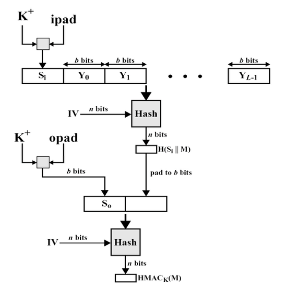
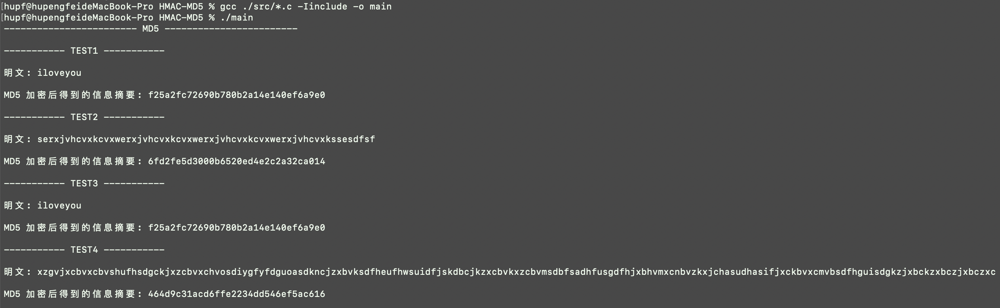

# HMAC-MD5 算法设计报告

- [HMAC-MD5 算法设计报告](#hmac-md5-算法设计报告)
  - [文件结构说明](#文件结构说明)
  - [代码运行说明](#代码运行说明)
  - [Github 地址](#github-地址)
  - [实验环境](#实验环境)
  - [MD5 算法原理概述](#md5-算法原理概述)
    - [简要介绍](#简要介绍)
    - [算法流程图](#算法流程图)
    - [算法过程](#算法过程)
  - [HMAC 算法原理概述](#hmac-算法原理概述)
    - [简要介绍](#简要介绍-1)
    - [算法流程图](#算法流程图-1)
    - [算法过程](#算法过程-1)
  - [总体结构设计](#总体结构设计)
  - [数据结构设计](#数据结构设计)
  - [模块分解](#模块分解)
  - [C 语言源代码](#c-语言源代码)
  - [编译运行结果](#编译运行结果)
    - [实验用例说明](#实验用例说明)
    - [编译运行过程](#编译运行过程)
  - [验证用例](#验证用例)
  - [实验总结](#实验总结)

## 文件结构说明

本实验中代码文件结构如下：


- `include`：该目录下存储了本次实验的 `.h` 头文件代码
- `src`：该目录下存储了本次实验的 `.c` 文件代码

## 代码运行说明

进入到 `HMAC-MD5` 目录下使用如下命令生成可执行文件 `main`：

`gcc ./src/*.c -Iinclude -o main`

生成可执行文件后，继续输入命令：

`./main`

即可运行本程序，看到实验结果

## Github 地址

由于代码文件的打包，会因为操作系统的不同，可能压缩文件中代码的中文符号会出现乱码，本次实验的中文注释是比较详细的，所以在此放出本次项目的 github 地址，里面保存了本次实验的代码：

[传送门](https://github.com/hupf3/inf_security/tree/master/HMAC-MD5)

（好像用 `VScode` 打开不会有乱码问题）

## 实验环境

**操作系统**：MAC OS 

**编译器**：Clang

## MD5 算法原理概述

### 简要介绍

MD5 使用 `little-endian` (小端模式)，输入任意不定长度信息，以 512-bit 进行分组，生成四个 32-bit 数据，最后联合输出固定 128-bit 的信息摘要。

### 算法流程图


### 算法过程

算法的基本过程为：填充、分块、缓冲区初始化、循环压缩、得出结果(信息摘要)。

下面分步骤详细介绍算法的过程：

- 填充：首先计算出明文 M 的位数 B，计算 $R = B\%512$ ， 如果 R <= 448，则需要在明文 M 后面补 10...0 的形式，直到 R = 448；如果 R > 448，则需要将 M 后面补 10...0 的形式，直到下一个余数 $R_1$ = 448。填充后，需要将明文 M 的位数扩展到 64 位补充到填充后的明文 M 的后面。

- 分块：再上一步填充中，已经将明文的位数变成了 512 * N，所以将明文分解成 N 个 512 位的块，每一个块用 16 个 32 位的结构进行存储。

- 缓冲区初始化：每个带 4 个字节 (32-bit) 的 4 个寄存器构成向量 (A, B, C, D)，也称 MD 缓冲区。以下 16 进制初值作为 MD 缓冲区的初始向量 IV， 并采用小端存储 (little-endian) 的存储结构:

  - A = 0x67452301
  - B = 0xEFCDAB89
  - C = 0x98BADCFE 
  - D = 0x10325476

  Little-endian 将低位字节排放在内存的低地址端，高位字节 排放在内存的高地址端。相反 big-endian 将高位字节排放 在内存的低地址端，低位字节排放在内存的高地址端。 Endianess 存储结构与 CPU 体系结构和语言编译器有关。

- 循环压缩：

  - 以512-bit 消息分组为单位，每一分组 $Y_q(q=0,1,...,L-1)$ 经过 4 个循环的压缩算法，表示为：

    $CV_0=IV$

    $CV_i=H_{MD5}(CV_{i-1},Y_{i-1}),i=1,...,L.$ 

  - 输出结果 hash 值：$MD=CV_L$

    

  - $H_{MD5}$ 从 CV 输入128 位，从消息分组输入 512 位，完成 4 轮循环后，输出 128 位，作为用于下一轮输入的 CV 值。

  - 每轮循环分别固定不同的生成函数 F, G, H, I，结合指定的 T 表元素 T[] 和消息分组的不同部分 X[] 做 16 次迭代运算，生成下一轮循环的输入。

  - 4 轮循环共有 64 次迭代运算。

  - 4轮循环中使用的生成函数 g (也称轮函数) 是一个 32 位非线性逻辑函数。同一轮循环的所有迭代使用相同的 g 函数，而各轮循环对应的 g 函数具有不同的定义:

    | 轮次 |  Function g  |   g(b, c, d)   |
    | :--: | :----------: | :------------: |
    |  1   | $F(b, c, d)$ | $(b∧c)∨(¬b∧d)$ |
    |  2   | $G(b, c, d)$ | $(b∧d)∨(c∧¬d)$ |
    |  3   | $H(b, c, d)$ |    $b⊕c⊕d$     |
    |  4   | $I(b, c, d)$ |   $c⊕(b∨¬d)$   |

  - 轮循环中的一次迭代运算逻辑

    - 对 A 迭代：$a←b + ((a + g(b, c, d) + X[k] + T[i]) <<< s)$ 

    - 缓冲区 (A, B, C, D) 作循环置换：$(B, C, D, A)←(A, B, C, D)$

    上述符号的说明：

    (1) a, b, c, d : MD 缓冲区 (A, B, C, D) 的各个寄存器的当前值。

    (2) g : 轮函数 F, G, H, I 中的一个。

    (3) <<< s : 将 32 位输入循环左移 (CLS) s 位;s 为规定值。

    (4) X[k] :当前处理消息分组 q 的第 k 个 (k = 0 .. 15) 32位字。如

    ​	 果消息 M 按 32-bit 编址，即为 $M_{q×16+k}$ 。

    (5) T[i] : T 表的第 i 个元素，32 位字；T 表总共有 64 个元素，也

    ​	 称为加法常数。

    (6) +：模 $2^{32}$ 加法

  - 各轮循环中第 i 次迭代 (i = 1 .. 16) 使用的 X[k] 的确定: 

    设 j = i - 1：

    - 第1轮迭代：k = j

      顺序使用 X[0,1,2,3,4,5,6,7,8,9,10,11,12,13,14,15]

    - 第2轮迭代：k = (1 + 5j) mod 16.
      顺序使用 X[1,6,11,0,5,10,15,4,9,14,3,8,13,2,7,12]

    - 第3轮迭代：k = (5 + 3j) mod 16.
      顺序使用 X[5,8,11,14,1,4,7,10,13,0,3,6,9,12,15,2]

    - 第4轮迭代：k = 7j mod 16.
      顺序使用 X[0,7,14,5,12,3,10,1,8,15,6,13,4,11,2,9]

  - T 表的生成函数：$T[i] = int(2^{32}×|sin(i)|)$

    其中 int 取整函数，sin 正弦函数，以 i 作为弧度输入。

  - 各轮各次迭代运算 (1 .. 64) 采用的左循环移位的位数 s 值：
    s[ 1 ... 16] = { 7, 12, 17, 22, 7, 12, 17, 22, 7, 12, 17, 22, 7, 12, 17, 22 } 

    s[17 ... 32] = { 5, 9, 14, 20, 5, 9, 14, 20, 5, 9, 14, 20, 5, 9, 14, 20 } 

    s[33 ... 48] = { 4, 11, 16, 23, 4, 11, 16, 23, 4, 11, 16, 23, 4, 11, 16, 23 } 

    s[49 ... 64] = { 6, 10, 15, 21, 6, 10, 15, 21, 6, 10, 15, 21, 6, 10, 15, 21 }

    (可以看出上面的移位 s )

- 得出结果：算法结束后，需要对 32 位的寄存器 A 的值按照 little-endian 转换成 4 个字节，顺序输出其 8 个 16 进制数符号;同样分别处理寄存器 B, C, D ，输出 MD5 值的其他 24 个 16 进制数符号。寄存器 A, B, C, D 联合输 出的结果是 32 个 16 进制数符号 (每个16进制数符号占 4 bits，共 128 bits)。

## HMAC 算法原理概述

### 简要介绍

HMAC 是密钥相关的哈希运算消息认证码（Hash-based Message Authentication Code）的缩写，由H.Krawezyk，M.Bellare，R.Canetti 于 1996 年提出的一种基于 Hash 函数和密钥进行消息认证的方法。

### 算法流程图



### 算法过程

- 如果密钥 k 的位数大于 512，则需要先对 k 进行摘要算法(MD5)，然后对共享密钥 k 后边补 0，生成一个 b 位的数据块 $K^+$; 
- $K^+$ 与 ipad 作 XOR，生成 b 位的 $S_i$;
- 对 $(S_i ‖ M)$ 进行 hash 压缩(例如 MD5 )，得到 $H(S_i ‖ M)$;
- K+ 与 opad 作 XOR，生成 b 位的 $S_o$;
- 对 $S_o ‖ H(S_i ‖ M)$ 进行 hash 压缩(例如 MD5 )，得到 $HMAC_K = H(S_o ‖ H(S_i ‖ M))$.

**说明**：

- M – HMAC 输入的消息明文
- H – 循环压缩函数
- b – 输入块的位数
- k – 密钥, |k| <= b
- n – 哈希码长度
- ipad – 00110110 重复 b/8 次 
- opad – 01011100 重复 b/8 次

## 总体结构设计

目录的代码文件结构如下：


- `include 目录`：包括本次代码的头文件部分
  - `HMAC_MD5.h`：`HMAC-MD5` 算法实现的头文件
  - `MD5.h`：`MD5` 算法实现的头文件
- `src 目录`：包括本次代码的 `.c` 代码文件部分
  - `HMAC_MD5.c`：`HMAC-MD5` 算法实现的代码文件
  - `MD5.c`：`MD5` 算法实现的代码文件
  - `main.c`：包含了四组测试，验证算法设计的正确与否

## 数据结构设计

**说明**：本次实验用到了 `stdint.h` 库，里面定义了新的数据类型，他们对位数的定义很明确，所以本次实验应用了这些数据类型：

`uint8_t`：8 位相当于 char

`uint32_t`：32 位相当于 int

`uint64_t`：64 位相当于 long long

本部分主要讲各代码文件应用到的数据结构(数据结构都在头文件中定义，所以直接介绍头文件中的数据结构定义)：

- `HMAC_MD5.h`：
  - `uint8_t *KPlus` ：数据块 $K^+$
  - `uint8_t *Si`：数据块 $S_i$
  - `uint8_t *So`：数据块 $S_o$
- `MD5.h`：
  - `typedef struct Block`：定义了 512 位的消息分组，该结构体包含了 `uint32_t buffer[16]` 成员，该成员将 512 位消息分成了 16 组 32 位的消息。
  - `block *blocks`：块数组
  - `uint64_t blocksNum`：512 位的块数
  - `uint64_t bits`：明文的位数
  - `uint32_t T[64]`：T 表
  - `uint32_t reg[4]`：初始化寄存器 A、B、C、D
  - `uint32_t regCur[4]`：当前寄存器 A、B、C、D
- `main.c`：
  - `const uint8_t *M`：明文
  - `const uint8_t *K`：密钥
  - `uint64_t MLen`：明文的长度
  - `uint64_t KLen`：密钥的长度
  - `uint8_t digest[16]`：MD5 输出得到的 128 位消息摘要
  - `uint8_t hmac[16]`：HMAC-MD5 输出得到的结果
  - `int err`：判断能否解密成功

## 模块分解

本部分将对每个代码文件进行详细的分析：

- `MD5`：

  - `轮函数`：我将轮函数用 #define 进行定义：

    ```c
    #define F(a, b, c) ((a & b) | (~a & c))
    #define G(a, b, c) ((a & c) | (b & ~c))
    #define H(a, b, c) (a ^ b ^ c)
    #define I(a, b, c) (b ^ (a | ~c))
    ```

  - `void init_T();`：对 T 表进行了初始化

    ```c
    void init_T(){
        for (int i = 1; i <= 64; i++)
            T[i - 1] = (uint32_t)((double)(((uint64_t)1) << 32) * fabs(sin(i)));
    }
    ```

  - `void fill(const uint8_t *M, uint64_t MLen);`：对明文进行填充，计算需要分得的块数：

    ```c
    void fill(const uint8_t *M, uint64_t MLen){
        bits = MLen * 8; // 明文的位数
        uint64_t r = bits % 512; // 取余
        // 计算分成的块数
        if (r < 448) blocksNum = bits / 512 + 1;
        else blocksNum = bits / 512 + 2;
    }
    ```

  - `void devideIntoBlock(const uint8_t *M, uint64_t MLen);`：需要对填充后的明文进行分块

    ```c
    void devideIntoBlock(const uint8_t *M, uint64_t MLen) {
        // 初始化分组消息块
        blocks = (block *)malloc(blocksNum * sizeof(block)); 
        for (uint64_t i = 0; i < blocksNum; ++i) memset(blocks + i, 0, sizeof(block));
    
        uint64_t index = 0; // 扫描明文的索引
        int flag = 1; // 跳出循环标志
        for (int i = 0; i < blocksNum && flag; ++i){
            for (int j = 0; j < 16 && flag; ++j){
                for (int k = 0; k < 4 && flag; ++k){
                    uint32_t val = M[index];
    
                    // 如果扫描到了明文的最后一个字符跳出循环
                    if (index++ == MLen){
                        val = (1 << 7);
                        flag = 0;
                    }
    
                    // 将明文信息填入到block中的buffer
                    blocks[i].buffer[j] |= (val << (k * 8));
                }
            }
        }
    
        // 将明文的位数补充到块中
        blocks[blocksNum - 1].buffer[16 - 2] = (uint32_t)bits;
    }
    ```

  - `void bufferInit();`：缓冲区初始化

    ```c
    void bufferInit(){
        reg[0] = 0x67452301;
        reg[1] = 0xefcdab89;
        reg[2] = 0x98badcfe;
        reg[3] = 0x10325476;
    }
    ```

  - `void cyclicCompression();`：循环压缩

    ```c
    // 循环移位
    uint32_t cyclicShift(uint32_t a, uint32_t b){
        return (a << b) | (a >> (32 - b));
    }
    
    // 获取寄存器当前值
    uint32_t getCurReg(int index, int offset){
        return regCur[(index + offset) % 4];
    }
    
    // 循环压缩
    void cyclicCompression(uint8_t *digest){
        int k, index;
        for (uint64_t i = 0; i < blocksNum; ++i) {
            // 提取到消息分组的位
            const uint32_t *X = blocks[i].buffer;
    
            // 初始化当前寄存器中的值
            memcpy(regCur, reg, sizeof(regCur));
            index = 0;
    
            // 第1轮16次迭代
            k = 0; const uint32_t s1[4] = {7, 12, 17, 22}; // 设置k值和移位值
            for (int j = 0; j < 16; ++j) {
                regCur[index] = getCurReg(index, 1) + cyclicShift((getCurReg(index, 0) + F(getCurReg(index, 1), getCurReg(index, 2), getCurReg(index, 3)) + X[k] + T[j]), s1[j & 3]);
                index = ((index + 3) % 4);
                k ++;
            }
    
            // 第2轮16次迭代
            k = 1; const uint32_t s2[4] = {5, 9, 14, 20}; // 设置k值和移位值
            for (int j = 16; j < 32; ++j) {
                regCur[index] = getCurReg(index, 1) + cyclicShift((getCurReg(index, 0) + G(getCurReg(index, 1), getCurReg(index, 2), getCurReg(index, 3)) + X[k] + T[j]), s2[j & 3]);
                index = ((index + 3) % 4);
                k = (k + 5) % 16;
            }
    
            // 第3轮16次迭代
            k = 5; const uint32_t s3[4] = {4, 11, 16, 23}; // 设置k值和移位值
            for (int j = 32; j < 48; ++j) {
                regCur[index] = getCurReg(index, 1) + cyclicShift((getCurReg(index, 0) + H(getCurReg(index, 1), getCurReg(index, 2), getCurReg(index, 3)) + X[k] + T[j]), s3[j & 3]);
                index = ((index + 3) % 4);
                k = (k + 3) % 16;
            }
    
            // 第4轮16次迭代
            k = 0; const uint32_t s4[4] = {6, 10, 15, 21}; // 设置k值和移位值
            for (int j = 48; j < 64; ++j) {
                regCur[index] = getCurReg(index, 1) + cyclicShift((getCurReg(index, 0) + I(getCurReg(index, 1), getCurReg(index, 2), getCurReg(index, 3)) + X[k] + T[j]), s4[j & 3]);
                index = ((index + 3) % 4);
                k = (k + 7) % 16;
            }
    
            // 更新寄存器中的值
            for (int j = 0; j < 4; ++j) reg[j] += regCur[j];
        }
    }
    ```

  - `void computeDigest(uint8_t *digest);`：计算得到输出摘要

    ```c
    void computeDigest(uint8_t *digest){
        for (int i = 0; i < 4; ++i)
            for (int j = 0; j < 4; ++j)
                digest[(i << 2) | j] = ((reg[i] >> (j * 8)) & 255);
    }
    ```

  - `void MD5(uint8_t *digest, const uint8_t *M, uint64_t MLen);`：总MD5 算法的流程

    ```c
    // MD5 算法
    void MD5(uint8_t *digest, const uint8_t *M, uint64_t MLen) {
        // 初始化T表
        init_T();
    
        // MD5 算法过程
        fill(M, MLen);              // 填充
        devideIntoBlock(M, MLen);   // 分块
        bufferInit();               // 缓冲区初始化
        cyclicCompression(digest);  // 循环移位
    
        // 计算得到输出摘要
        computeDigest(digest);
    
        // 释放内存
        free(blocks);
    }
    ```

- `HMAC_MD5`：

  - `void initData();`：初始化数据

    ```c
    void initData(uint64_t MLen){
        KPlus = (uint8_t*)malloc(64 * sizeof(uint8_t));
        Si = (uint8_t*)malloc((64 + (MLen > 16 ? MLen : 16)) * sizeof(uint8_t));
        So = (uint8_t*)malloc(80 * sizeof(uint8_t));
    }
    ```

  - `void checkKLen(int *err, int KLen);`：检测密钥 K 的长度，如果大于 512 位则无法加密

    ```c
    void checkKLen(int *err, int KLen){ if (KLen > 64) *err = 1; }
    ```

  - `void fillZero();`：对密钥补零，如果 KLen 长度大于 512 需要先进行摘要算法(MD5)

    ```c
    void fillZero(uint64_t MLen, const uint8_t *K, uint64_t KLen){
        // 如果KLen长度大于512需要先进行摘要算法
        if (KLen > 64){
            uint8_t *digestT = (uint8_t*)malloc(16 * sizeof(uint8_t));
            MD5(digestT, K, KLen);
            memcpy(KPlus, digestT, 16);
            memset(KPlus + 16, 0, 48 * sizeof(uint8_t)); // 后方补零
        }
        else {
            memcpy(KPlus, K, KLen);
            memset(KPlus + KLen, 0, (64 - KLen) * sizeof(uint8_t)); // 后方补零
        }
    }
    ```

  - `void getSi();`：$K^+$ 与 ipad 异或生成 $S_i$，并生成 $(S_i ‖ M)$

    ```c
    void getSi(const uint8_t *M, uint64_t MLen){ 
        for (int i = 0; i < 64; ++i) Si[i] = KPlus[i] ^ IPAD;  
        memcpy(Si + 64, M, MLen); // 得到(Si ‖ M)
    }
    ```

  - `void getSo();`：$K^+$ 与 opad 异或生成 $S_i$

    ```c
    void getSo(){ 
        for (int i = 0; i < 64; ++i) So[i] = KPlus[i] ^ OPAD; 
        memcpy(So + 64, Si + 64, 16); // 得到 So ‖ H(Si ‖ M)
    }
    ```

  - `void HMAC_MD5(uint8_t *hmac, const uint8_t *M, uint64_t MLen, const uint8_t *K, uint64_t KLen, int *err);`：HMAC-MD5 算法总流程

    ```c
    void HMAC_MD5(uint8_t *hmac, const uint8_t *M, uint64_t MLen, const uint8_t *K, uint64_t KLen, int *err) {
        initData(MLen);                 // 数据初始化
        checkKLen(err, KLen);           // 检测密钥K的长度
        if (*err == 1) return ;         // 不符合退出算法
        
        // HMAC-MD5 算法过程
        fillZero(MLen, K, KLen);        // 补零
        getSi(M, MLen);                 // K+与ipad异或生成Si
        MD5(Si + 64, Si, 64 + MLen);    // hash 压缩得到 H(Si ‖ M)
        getSo();                        // K+与opad生成So
        MD5(hmac, So, 80);              // hash 压缩得到 hmac
    
        // 释放内存
        free(KPlus);
        free(Si);
        free(So);
    }
    ```

- `main.c`：设计了四个测试样例去检验实验的准确性，就不贴出所有代码了，我将所有的过程都封装成了函数，直接看 main 函数中的部分就可以清楚地知道该文件的流程

  ```c
  int main() {
      init(); // 初始化数据
  
      // ----------- MD5 -----------
      MD5(digest1, M1, MLen1); // MD5加密算法
      MD5(digest2, M2, MLen2); // MD5加密算法
      MD5(digest3, M3, MLen3); // MD5加密算法
      MD5(digest4, M4, MLen4); // MD5加密算法
      print_MD5(); // 输出MD5加密算法结果
  
      // ----------- HMAC-MD5 -----------
      HMAC_MD5(hmac1, (uint8_t*)M1, MLen1, (uint8_t*)K1, KLen1, &err1); // HMAC-MD5算法
      HMAC_MD5(hmac2, (uint8_t*)M2, MLen2, (uint8_t*)K2, KLen2, &err2); // HMAC-MD5算法
      HMAC_MD5(hmac3, (uint8_t*)M3, MLen3, (uint8_t*)K3, KLen3, &err3); // HMAC-MD5算法
      HMAC_MD5(hmac4, (uint8_t*)M4, MLen4, (uint8_t*)K4, KLen4, &err4); // HMAC-MD5算法
      print_HMAC_MD5(); // 输出HMAC-MD5算法结果
      return 0;
  }
  ```

## C 语言源代码

源代码在压缩包中有，我就不贴出来了，具体模块讲解上面已经写的很详细了 ^_^

## 编译运行结果

### 实验用例说明

本次实验选择了四个测试样例，来验证算法的准确性

- `TEST1`：明文的位数模 512 < 448
- `TEST2`：明文的位数模 512 > 448
- `TEST3`：密钥的位数大于 512
- `TEST4`：明文和密钥的长度都很长，都远大于 512 位

### 编译运行过程

本实验的结果是先显示每个测试样例的 MD5 加密后的结果，再显示 HMAC-MD5 加密后的结果

编译命令：

`gcc ./src/*.c -Iinclude -o main`

运行命令：

`./main`

运行结果如下所示：




## 验证用例

我找到了一个在线加密解密网站，可以通过输入明文信息和密钥，得到最后的输出结果，这样可以方便验证自己的结果是否正确，下面是对四个测试样例的验证：

- `MD5`
  - `TEST1`：

    

  - `TEST2`：

    

  - `TEST3`：与 `TEST1` 结果相同，就不做测试了

  - `TEST4`：
  
    

- `HMAC-MD5`

  - `TEST1`：

    

  - `TEST2`：

    

  - `TEST3`：

    

  - `TEST4`：

    

## 实验总结

本次实验的难度适中，但是学会了如何用 c 去编写 MD5 和 HMAC-MD5 算法，对两个算法的流程有了更加深刻的理解，并且对 c 语言的库文件 `stdint.h` 中的数据类型运用更加熟悉。
