# Kerberos认证模型设计报告

## 个人信息

| 课程名称 | 信息安全技术 |   任课老师   |      蔡国扬      |
| :------: | :----------: | :----------: | :--------------: |
|   年级   |    2018级    | 专业（方向） |   软件工程专业   |
|   学号   |   18342025   |     姓名     |      胡鹏飞      |
|   电话   | 13944589695  |    Email     | 945554668@qq.com |

## 文件结构说明

本项目的文件结构如下图所示：

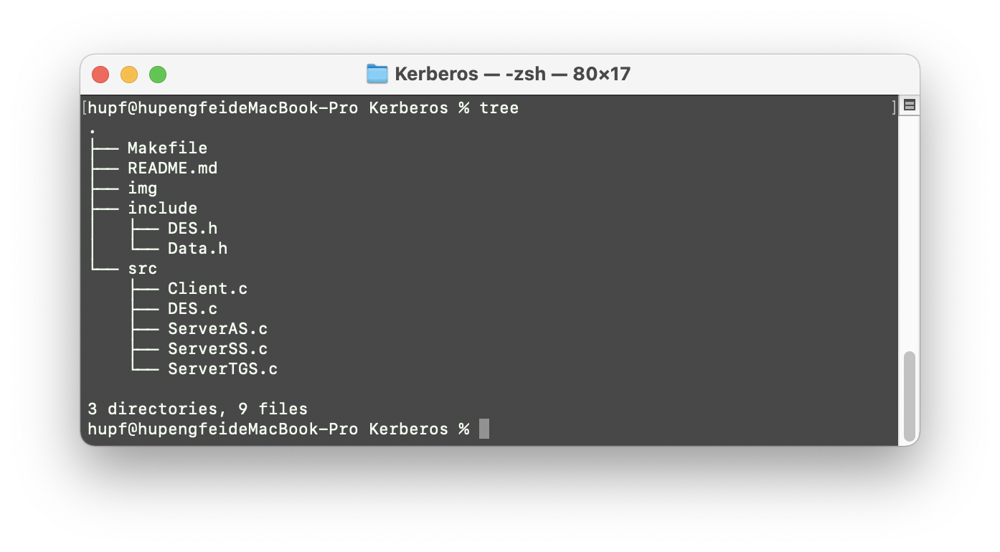

- `Makefile`：为本次项目构建和运行编写的 `Makefile` 文件
- `README.md`：本次项目的运行说明和设计报告
- `img`：存储 `README.md` 中需要的图片资源
- `include`：存储了本次项目所包括的 C 语言头文件
- `src`：存储了本次项目包括的 C 语言文件

## 代码运行说明

进入到 `Kerberos` 目录下执行以下命令

`make clean`

`make`

执行完上面的命令后本项目文件夹会出现两个新的目录 `build` 和 `bin` 

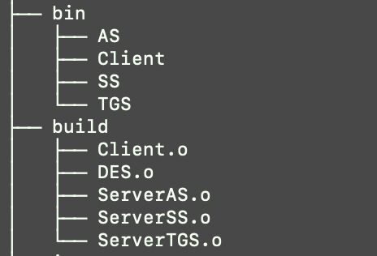

`build` 是用来存放 `.o` 中间文件，`bin` 目录存放本次项目的可执行文件

接下来打开四个终端，按照下面的顺序分别在不同的终端输入以下命令：

`./AS`

`./TGS`

`./SS`

`./Client`

按照以上步骤即可运行本程序，看到实验结果

**注意**：在运行前注意自己端口号为 8081，8082，8083的端口是否被占用，如果被占用可以修改代码中的端口号，重新运行本次项目。查看端口号是否被运行的命令如下所示，并且没有被占用的情况也如下：

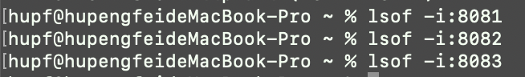

## 项目地址

[Github](https://github.com/hupf3/inf_security/tree/master/Kerberos)

## 实验环境

**操作系统**：MacOS

**编辑器**：Visual Studio Code 

## 原理概述

### Kerberos 介绍

Kerberos 是种网络身份验证协议,最初设计是用来保护雅典娜工程的网络服务器。Kerberos 这个名字源于希腊神话，是一只三头犬的名字，它旨在通过使用密钥加密技术为 Client/Server 序提供强身份验证。可以用于防止窃听、防止重放攻击、保护数据完整性等场合，是一种应用对称密钥体制进行密钥管理的系统。Kerberos 的扩展产品也使用公开密钥加密方法进行认证。

### 名词解释

- **AS（Authentication Server）**：认证服务器
- **KDC（Key Distribution Center）**：密钥分发中心
- **TGT（Ticket Granting Ticket**）：票据授权票据，票据的票据
- **TGS（Ticket Granting Server）**：票据授权服务器
- **SS（Service Server）**：特定服务提供端
- **Principal**：被认证的个体
- **Ticket**：票据，客户端用来证明身份真实性。包含：用户名，IP，时间戳，有效期，会话密钥

### 参与的各方角色

- **Client**: Application Client 应用客户端
- **AS**: Authentication Server 用来认证用户身份
- **TGS**: Ticket-Granting Service 用来授权服务访问
- **SS**: Service Server 用户所请求的服务

### 认证步骤

本次 `Kerberos` 认证模型过程主要分为四个部分，下面将分别介绍这四个部分

#### 用户登录

用户在登录的时候需要输入**用户名**和**密码**两个信息。然后在客户端，接收到用户输入的**密码**信息，将密码通过一个单向的 `Hash` 函数生成一个 `Client` 密钥

#### 客户端与 AS 服务器通信

客户端向 AS 发送一个明文消息，申请基于该用户所应享有的服务，比如“用户Bob想请求服务“(Bob 是该用户的 ID)。

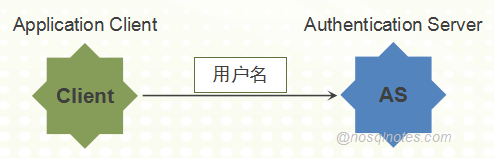

**注意**：用户是不会向 AS 发送用户密钥的，AS 会从本地的数据库中查询到该申请用户的密码，并且通过上面用户登录相同的单向 `Hash` 函数生成一个密钥

AS 首先会检查该用户 ID 是否存在于本地的数据库中：

- 如果本地数据库中没有改用户 ID 则会向客户端发送信息：“该用户不存在”，然后认证失败
- 如果数据库中存在改用户，则返回给客户端两条信息：
  - 消息 A：**Client/TGS会话密钥(Client/TGS Session Key)**（该Session Key 用在将来 Client 与 TGS 的通信上），通过 **用户密钥(user's secret key)** 进行加密
  - 消息 B：**票据授权票据(TGT)**（TGT 包括：消息A中的“Client/TGS会话密钥”(Client/TGS Session Key)，用户ID，用户网址，TGT有效期），通过**TGS密钥(TGS's secret key)** 进行加密

客户端收到消息 A 和消息 B，就可以尝试用自己的用户密钥对消息 A 进行解密，如果用户输入的密码与 AS 服务器数据库的密码相符就能够成功解密，得到 Client/TGS 会话密钥。**注意**：用户不能够解密消息 B，因为用户并没有 TGS 密钥。

解密得到了 Client/TGS 会话密钥，就可以与 TGS 服务器进行通信并且认证了

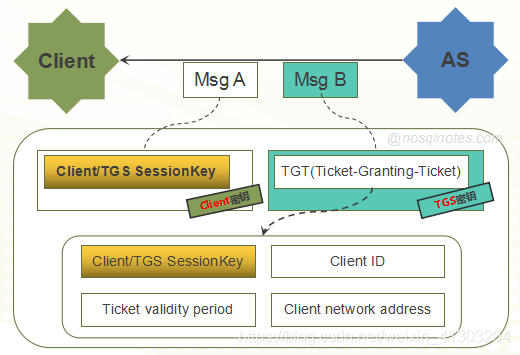

#### 客户端与 TGS 服务器通信

客户端需要申请特定服务，向 TGS 服务器发送以下两条消息：

- 消息 C：即消息B的内容（TGS's secret key 加密后的TGT），和想获取的服务的服务ID（**注意**：不是用户ID）
- 消息 D：**认证符(Authenticator)**（Authenticator包括：用户ID，时间戳），通过**Client/TGS会话密钥(Client/TGS Session Key)**进行加密

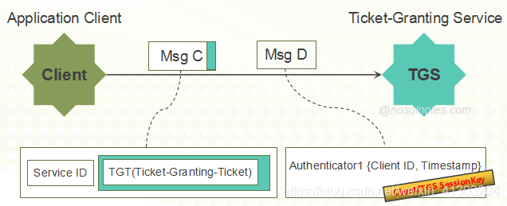

TGS 服务器端收到消息 C 和消息 D 后，首先检查数据库中是否存在所需的服务，查找到之后，TGS 用自己的 “TGS密钥” (TGS's secret key)解密消息 C 中的消息 B（也就是TGT），从而得到之前生成的“Client/TGS会话密钥”(Client/TGS Session Key)。TGS 再用这个 Session Key 会话密钥解密消息 D 得到包含用户ID和时间戳的 Authenticator，并对 TGT 和 Authenticator 进行验证，验证通过之后返回2条消息：

- 消息 E：**client-server票据(client-to-server ticket)**（该 ticket 包括：Client/SS 会话密钥 (Client/Server Session Key），用户 ID，用户网址，有效期），通过提供该服务的**服务器密钥(service's secret key)** 进行加密
- 消息 F：**Client/SS会话密钥( Client/Server Session Key)** （该Session Key 用在将来 Client 与 Server Service 的通信（会话）上），通过**Client/TGS会话密钥(Client/TGS Session Key)** 进行加密

客户端收到这些消息后，用 Client/TGS会话密钥解密消息 F 得到“Client/SS会话密钥”(Client/Server Session Key)。（**注意**：Client 不能解密消息 E，因为 E 是用“服务器密钥”(service's secret key)加密的）。

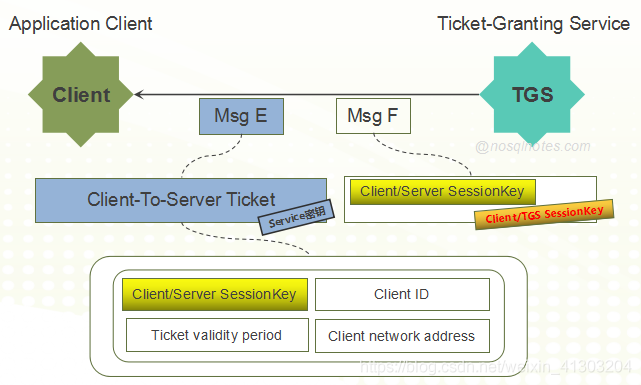

#### 客户端与 SS 服务器通信

当获得 “Client/SS会话密钥”(Client/Server Session Key) 之后，客户端就能够使用服务器提供的服务了。客户端向SS服务器发出2条消息：

- 消息 E：即上一步中的消息 E“client-server票据”(client-to-server ticket)，通过**服务器密钥(service's secret key)** 进行加密
- 消息 G：新的**Authenticator**（包括：用户ID，时间戳），通过**Client/SS会话密钥(Client/Server Session Key)** 进行加密

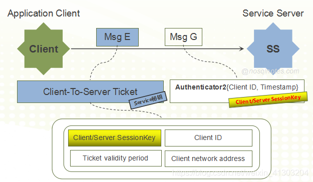

SS 服务器用自己的密钥(service's secret key)解密消息 E 从而得到TGS提供的Client/SS会话密钥(Client/Server Session Key)。再用这个会话密钥解密消息 G。得到 Authenticator，（同TGS一样）对 Ticket 和 Authenticator 进行验证，验证通过则返回1条消息：

- 消息 H：**新时间戳**（新时间戳是：Client 发送的时间戳加1），通过**Client/SS会话密钥(Client/Server Session Key)** 进行加密

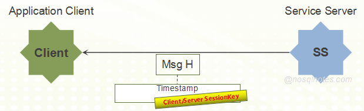

客户端通过 Client/SS 会话密钥(Client/Server Session Key)解密消息 H，得到新时间戳并验证其是否正确。验证通过的话则客户端可以信赖服务器，并向 SS 服务器发送服务请求；否则验证失败。

SS 服务器向客户端提供相应的服务。至此整个 Kerberos 认证过程结束。

#### 加密/解密算法

本次认证过程中需要对消息进行加密/解密操作，这里我选择的算法是 DES 算法，也是将第一次作业的内容进行了部分的修改整理，并且封装好了两个函数，分别是 `Encrypt` 加密和 `Decrypt` 解密放在 `DES.h` 文件中，方便认证过程中进行调用。

## 总体结构设计

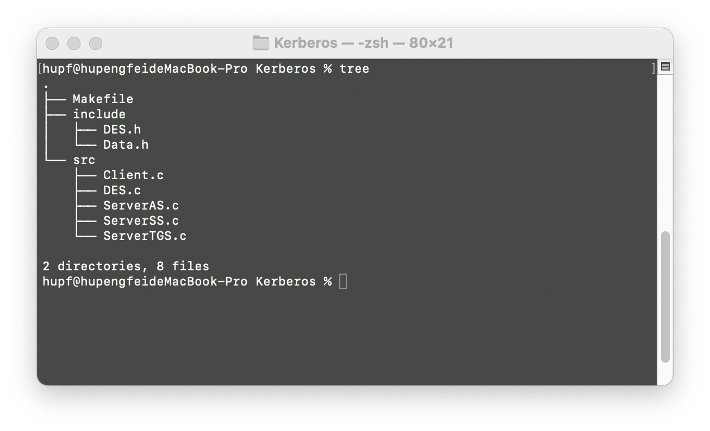

本次实验涉及到的代码文件如上图所示，下面分别介绍一下每个代码文件实现的作用：

- `include`：包含本次项目的头文件
  - `DES.h`：封装好的 DES 算法头文件，包括两个函数，分别是加密和解密
  - `Data.h`：包含 DES 算法所需要的表的信息
- `src`：包含本次项目的 C 语言文件
  - `Client.c`：本次认证模型的客户端
  - `DES.c`：实现 DES 算法的 C 文件，里面包含了代码实现的具体流程
  - `ServerAS.c`：AS 服务器与客户端通信的过程
  - `ServerTGS.c`：TGS 服务器与客户端通信的过程
  - `ServerSS.c`：SS 服务器与客户端通信的过程

## 数据结构设计

本次实验中并没有设计什么数据结构，就说一下本次实验中涉及到的一些变量的类型：

本次的消息我都是用的 `char` 数组进行存储的，以及相关的短期密钥，会话密钥，用户名，用户密码等信息：

```c
// 消息
char A[100], B[100], C[100], D[100], E[100], F[100], G[100], H[100];
// 消息长度
int lenA, lenB, lenC, lenD, lenE, lenF, lenG, lenH;

// 会话密钥
char TGS_Session_Key[100];
char SS_Session_Key[100];

// 服务器端密钥
char TGS_Key[] = "TGSKey";
char SS_Key[] = "SSKey";

char ClientID[] = "hupf3"; // AS服务器存储的用户名
char ClientKey[] = "MYKey"; // AS服务器存储的密钥
```

本实验中需要用到时间戳的概念，所以我选择了 `time.h` 头文件中的 `time_t` 变量进行存储该时间戳：

```c
// 时间戳
time_t timestamp1;
time_t timestamp2;
time_t timestamp3;
```

本次实验由于需要三个不同的服务器端与客户端进行相连所以需要，设置端口，端口的设置我直接用 `#define` 进行存储

```c
// 设置的端口号
#define AS_PORT 8081
#define TGS_PORT 8082
#define SS_PORT 8083
```

## 模块分解

本次项目的主要过程就是建立客户端和服务端，并且在二者之间进行通信，所以下面分别介绍，自己创建的客户端，三个服务端，以及它们之间通信的过程：

- 客户端向 AS 服务端发送数据：
- AS 服务端向客户端发送数据：
- 客户端向 TGS 服务端发送数据：
- TGS 服务端向客户端发送数据：
- 客户端向 SS 服务端发送数据：
- SS 服务端向客户端发送数据：

## C语言源代码

源代码在压缩包中有，并且文件过长，我就不贴出来了，具体模块讲解上面已经写的很详细了 ^_^

[Github地址](https://github.com/hupf3/inf_security/tree/master/Kerberos)

## 编译运行结果

在运行前，先检查8081，8082，8083端口是否被占用，如果没有被占用则可运行以下命令进行编译代码文件生成代码的可执行文件

`make clean`

`make`

执行后的结果如下所示：

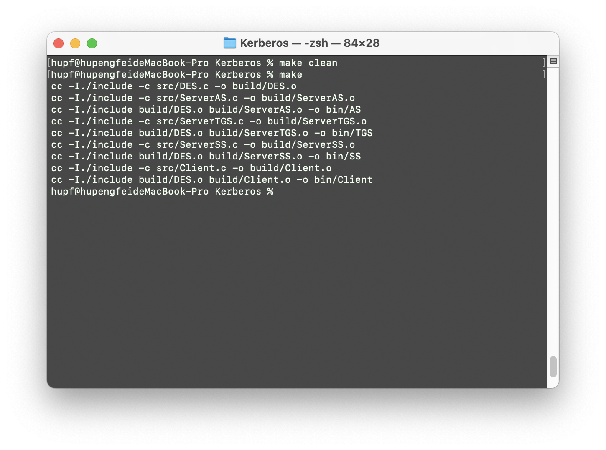

生成的可执行文件在当前目录下的 `bin	` 路径中，分别存有 `AS`, `TGS`, `SS`,`Client` 可执行文件，分别打开四个终端窗口，并且按照以下的顺序在不同的终端中输入命令即可成功运行本次项目，查看结果：

`./AS`

`./TGS`

`./SS`

`./Client`

运行结果如下所示：

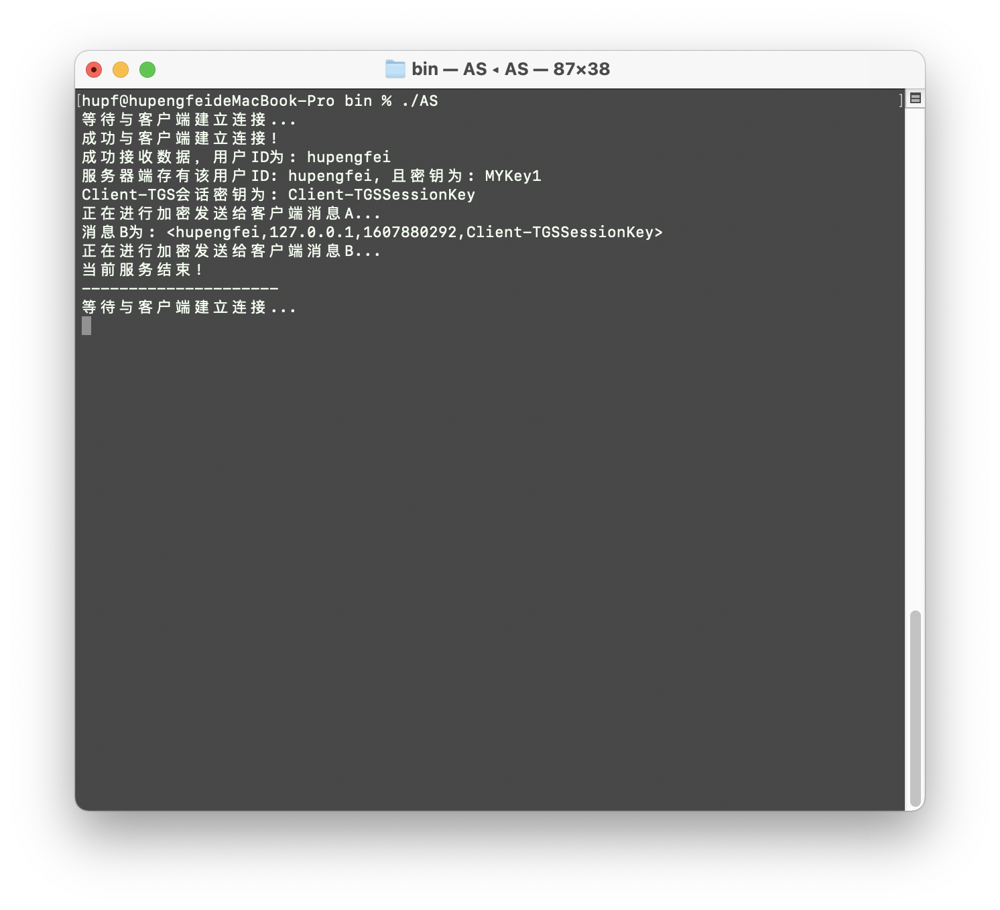

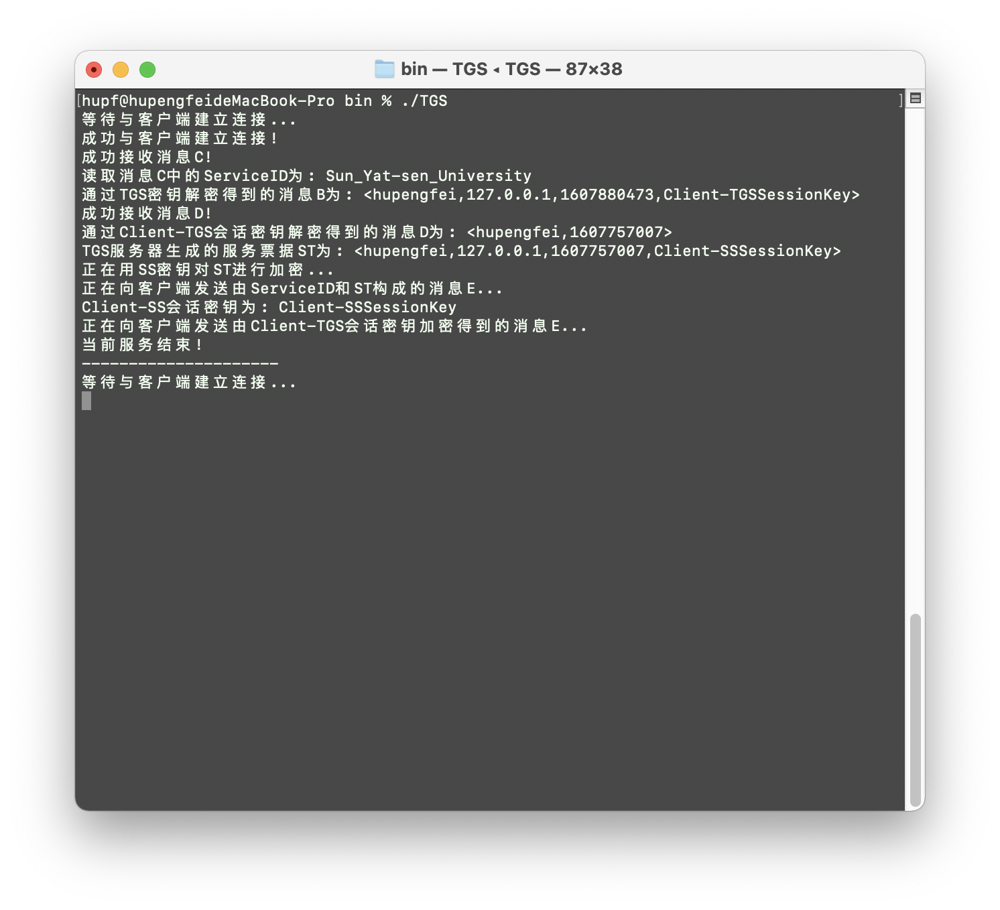

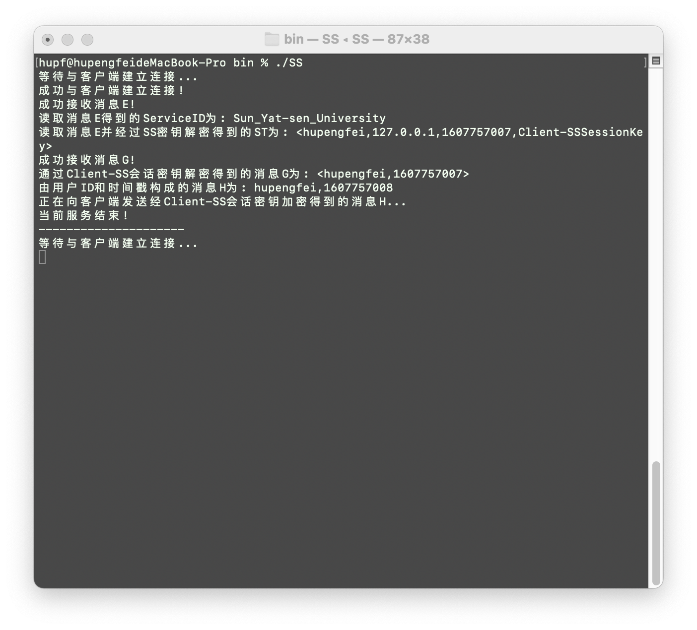

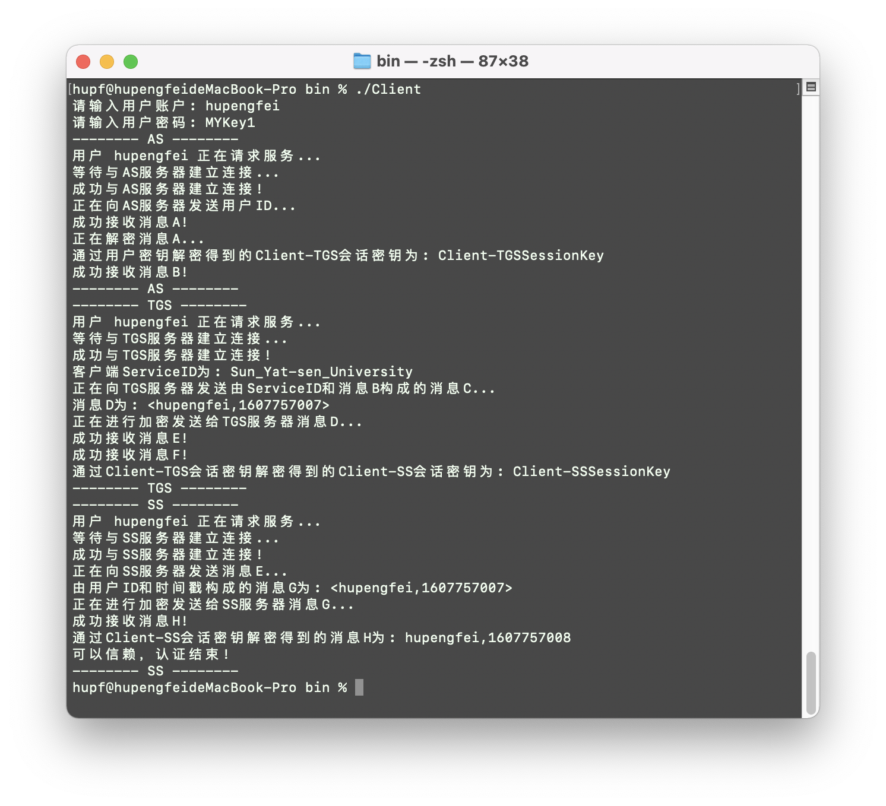

通过上面的结果可以看出本次认证成功，项目的编写是正确的。

## 验证用例

成功的用例如下所示，只展示客户端的内容，即可知道认证成功：


失败的案例如输入的用户ID并没有在服务器的数据库中有相关的数据，得到的结果如下所示：

- `AS` 服务器端：

  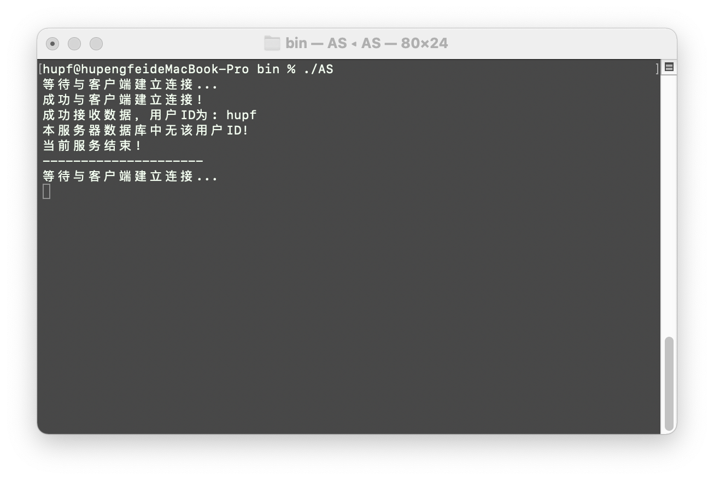

- 客户端：

  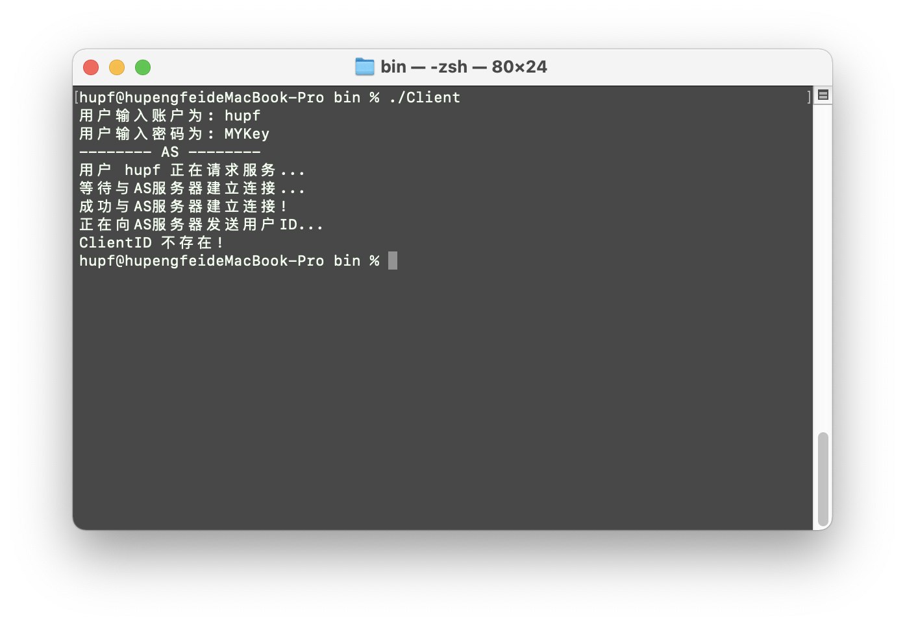

## 实验总结

通过本次实验了解到了 kerberos 认证的整个过程，并且能够通过 C 语言将其实现出来。本次项目也用到了进程间通信，以及服务器端和客户端建立与沟通的过程，这也是对之前学习内容的一次回顾，也是更加熟悉了这方面的操作。并且在本次实验中了解到了 `sprintf` 和 `sscanf` 函数的用法，两个函数在封装数据和读取数据的应用上都比较方便，在今后的学习中也会多多用两个函数解决问题。